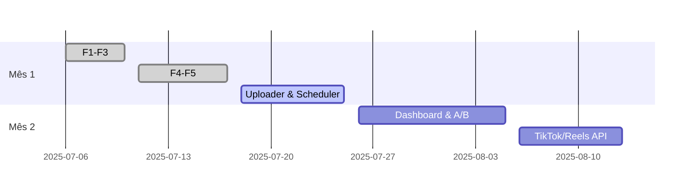

# GEMINI.md – Guia do Projeto

## AI Comic‑Style Short Video Generator & Publisher

> **Objetivo** Criar um pipeline totalmente automatizado que gera roteiros, imagens em estilo quadrinhos, narração, legendas, monta o vídeo e publica em canais “faceless” (YouTube Shorts/Reels/TikTok) – custo máximo **US \$ 20/mês**.

---

## Sumário

1. [Visão Geral](#visão-geral)
2. [Stack de Tecnologia](#stack-de-tecnologia)
3. [Requisitos de Ambiente](#requisitos-de-ambiente)
4. [Instalação Rápida](#instalação-rápida)
5. [Estrutura de Diretórios](#estrutura-de-diretórios)
6. [Gemini CLI – Comandos Essenciais](#gemini-cli--comandos-essenciais)
7. [Fluxo de Desenvolvimento](#fluxo-de-desenvolvimento)
8. [Pipeline IA Detalhado](#pipeline-ia-detalhado)
9. [Variáveis de Ambiente](#variáveis-de-ambiente)
10. [Gestão de Custos & Limites](#gestão-de-custos--limites)
11. [Checklist de Produção](#checklist-de-produção)
12. [Troubleshooting](#troubleshooting)
13. [Roadmap v0 → v1](#roadmap-v0-→-v1)
14. [Licenças & Créditos](#licenças--créditos)

---

## Visão Geral

Este repositório contém todo o código‑fonte e scripts de infraestrutura para gerar vídeos curtos (≤ 60 s) em massa, usando somente ferramentas de IA acessíveis via API ou open‑source. O **Gemini CLI** atua como engenheiro de software virtual, escrevendo/refatorando o código Python sob demanda.
RESPOSTAS SOMENTE EM PORTUGUÊS.

<div align="center"></div>

---

## Stack de Tecnologia

| Camada             | Tech                                         | Observações                                     |
| ------------------ | -------------------------------------------- | ----------------------------------------------- |
| **LLM**            | Gemini 2.5 Pro (✱free tier)                  | Roteiros, prompts de imagem, refactor de código |
|                    | GPT‑4o (OpenAI)                              | Backup/geração de imagem (DALL·E‑3) & voz (TTS) |
| **Modelos locais** | Wan‑2.1 (<30 s/q 480 p) • XTTS‑v2 (voz)      | Fallback quando orçamento estoura               |
| **Runtime**        | Python 3.11 • FFmpeg • Node 20 (Gemini CLI)  |                                                 |
| **DevOps**         | Google Colab (T4) • GitHub Actions (testes)  | Build & publish CI/CD                           |
| **APIs**           | YouTube Data v3 • TikTok Upload • Meta Graph | Publicação multi‑plataforma                     |

✱ **Gemini CLI quota:** 1 000 req/dia • 60 req/min (grátis)

---

## Requisitos de Ambiente

> **Observação:** O projeto foi testado com `python3` (qualquer versão ≥ 3.8). Caso seu sistema disponha apenas do binário `python3`, utilize-o nos comandos em vez de `python3.11`. O restante das instruções permanece inalterado.

```text
Ubuntu 20.04 + (ou WSL 2 / macOS 12+ / Windows 11)
Python ≥ 3.11   (pyenv recomendado)
Node.js ≥ 20.x   (para Gemini CLI)
FFmpeg 6.x       (compilado com libfreetype)
Git ≥ 2.39
GPU CUDA 11 (opcional p/ Colab)
```

---

## Instalação Rápida

```bash
# 1. Clone o repo
$ git clone https://github.com/your‑org/ai‑video‑gpt.git && cd ai‑video‑gpt

# 2. Ambiente Python isolado
$ python3 -m venv .venv && source .venv/bin/activate
$ pip install -r requirements.txt  # (gera requirements via Gemini)

# 3. Node & Gemini CLI (versão local via npx)
$ npx https://github.com/google‑gemini/gemini‑cli  # primeiras execuções
#  ou global
$ npm i -g @google/gemini-cli && gemini --version

# 4. Variáveis de ambiente
$ cp .env.example .env        # edite chaves
$ source .env                 # carregue no shell
```

> 💡 **Windows**: use Git Bash ou PowerShell; substitua `source` por `.\.venv\Scripts\activate`.

---

## Estrutura de Diretórios

```text
ai‑video‑gpt/
├── GEMINI.md              ← este guia
├── .env.example
├── requirements.txt
├── Makefile               ← tarefas encurtadas
├── src/
│   ├── __init__.py
│   ├── scriptgen.py       ← F1 – gera roteiro
│   ├── prompt.py          ← F2 – prompts de imagem
│   ├── imagegen.py        ← F3 – imagens IA
│   ├── voice.py           ← F4 – TTS
│   ├── assemble.py        ← F5 – monta vídeo
│   ├── uploader.py        ← F6 – YouTube API
│   └── main.py            ← CLI unificada
├── tests/                 ← pytest + coverage
│   └── test_scriptgen.py
└── .assets/               ← thumbnails, diagramas
```

---

## Gemini CLI – Comandos Essenciais

| Ação                 | Comando                                | Notas                                  |
| -------------------- | -------------------------------------- | -------------------------------------- |
| Abrir REPL           | `gemini`                               | Login via Google; cria pasta `.gemini` |
| Modo YOLO (auto‑yes) | `gemini --yolo` ou `Ctrl + Y`          | Aceita todas escritas de arquivo       |
| Alternar modelo      | `/model gemini-1.5-pro-latest`         | Checar `/model list`                   |
| Stats de uso         | `/stats`                               | Requests/dia/min                       |
| Help rápido          | `/help`                                | Lista comandos internos                |
| Execução inline      | `!python src/main.py`                  | Roda script sem sair do REPL           |
| Adicionar ferramenta | `/tools add veo http://localhost:3978` | MCP server (ex.: Veo)                  |
| Persistir segredo    | `/memory pin OPENAI_API_KEY=<key>`     | Evita expor no fs                      |

---

## Fluxo de Desenvolvimento

1. **Planejar** — abrir `gemini` e criar esqueleto via prompt “Crie ...”.
2. **Gerar código** — deixar YOLO on, iterar arquivos até testes passarem.
3. **Testar local** — ativo o venv, roda o `main.py` para um tema.
4. **Comitar** — push no GitHub após `pytest -q` verde.
5. **CI/CD** — GitHub Actions executa `pytest`, `black --check` e build.
6. **Deploy** — artefato final (script ou Docker) enviado a Colab/VM.

> 🏷️ **Convencões Git**: `feat/`, `fix/`, `chore/`, `docs/` + Conventional Commits.

---

## Pipeline IA Detalhado

| Etapa       | Módulo                        | Latência alvo   | Custo alvo  |
| ----------- | ----------------------------- | --------------- | ----------- |
| 1. Roteiro  | `scriptgen.generate_script()` | ≤ 5 s           | \~0,002 USD |
| 2. Prompts  | `prompt.scene_prompts()`      | ≤ 2 s           | —           |
| 3. Imagens  | `imagegen.img_from_prompt()`  | ≤ 25 s (4 imgs) | ≤ 0,05 USD  |
| 4. Voz      | `voice.tts()`                 | ≤ 8 s           | ≤ 0,03 USD  |
| 5. Legenda  | `whisper.generate_srt()`      | ≤ 3 s           | ≤ 0,005 USD |
| 6. Montagem | `assemble.build_video()`      | ≤ 10 s          | —           |
| 7. Upload   | `uploader.youtube_upload()`   | ≤ 5 s           | —           |

**Tempo total alvo:** ≤ 10 min (incl. fila Colab GPU) • **Custo/vídeo:** ≤ US \$ 0,15

---

## Variáveis de Ambiente

```dotenv
# IA & Modelos
GEMINI_API_KEY=
OPENAI_API_KEY=
WAN_AUTH_TOKEN=
XTTS_MODEL_PATH=/models/xtts_v2

# Storage & Infra
FFMPEG_PATH=/usr/bin/ffmpeg
OUTPUT_DIR=./output

# YouTube
YOUTUBE_CLIENT_SECRET_JSON=./.secrets/client_secret.json
YOUTUBE_CHANNEL_ID=

# Controles de custo
TOKEN_BUDGET_USD=20
```

---

## Gestão de Custos & Limites

1. **Hard‑limit** no dashboard OpenAI (`Usage > Hard limit` = US \$ 20).
2. Monitore `/stats` no Gemini; set `GEMINI_MAX_REQUESTS_PER_DAY` ≤ 800.
3. Ative fallback local (`USE_LOCAL_MODELS=true`) quando `TOKEN_BUDGET_REACHED=1`.
4. Gere relatórios semanais (`scripts/cost_report.py`) → Google Sheets.

---

## Checklist de Produção

* [ ] `.env` preenchido & fora do Git (`.gitignore`)
* [ ] `pytest` 100 % verde
* [ ] `make video THEME="teste"` gera vídeo .mp4 ≤ 60 s
* [ ] Custo < 0,15 USD/vídeo (log 🡒 `output/costs.log`)
* [ ] Upload manual rodou OK (scope `youtube.upload`)
* [ ] Cron/CI agendado para 5 vídeos/dia em Colab ou VM

---

## Troubleshooting

| Sintoma                     | Causa provável          | Solução                                        |
| --------------------------- | ----------------------- | ---------------------------------------------- |
| `gemini: command not found` | NPM global não instalou | Use `npx` ou adicione `npm bin -g` ao PATH     |
| `GPU unavailable` no Colab  | Quota cheia             | Tente seção noturna ou force CPU (mais lento)  |
| `OpenAI: RateLimitError`    | many req/min            | Insira `time.sleep(60/req_per_min)` no wrapper |
| Vídeo sem áudio             | XTTS path incorreto     | Verifique `XTTS_MODEL_PATH` e permissões       |
| Upload falha 403            | Token OAuth expirado    | Delete `~/.oauth‑youtube.json` e re‑login      |

---

## Roadmap v0 → v1



---

## Licenças & Créditos

* Código © 2025 Marcos Vinicios C. Lopes (@markosfox1) – MIT.
* Modelos Wan‑2.1 e XTTS‑v2 – Apache 2.0.
* Outras marcas registradas pertencem aos respectivos detentores.

> *Contribuições são bem‑vindas! Abra uma issue ou pull request.*
